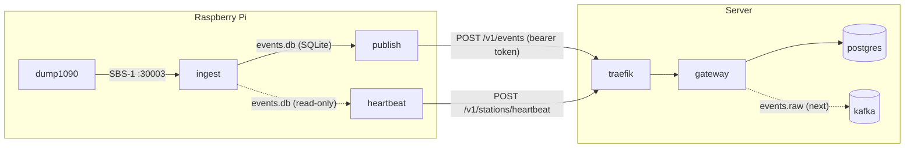

# Listening Post

An ADS-B flight tracking pipeline. [dump1090](https://github.com/flightaware/dump1090) is used to receive and decode ADS-B messages into the [SBS-1 BaseStation](http://woodair.net/sbs/article/barebones42_socket_data.htm) format.

## Architecture



Four processes run on the Pi:

- **dump1090** ([flightaware/dump1090](https://github.com/flightaware/dump1090)) — reads the SDR dongle, decodes ADS-B, and serves SBS-1 text on TCP port 30003. Not part of this repo; install from the FlightAware packages.
- **ingest** (`ingest/`, Python stdlib) — connects to dump1090 and appends every raw line to a SQLite table with a timestamp. Reconnects if dump1090 restarts.
- **publish** (`publish/`, Python stdlib) — reads batches from that table, POSTs them to the gateway, and deletes rows only after a 2xx. Retries while the gateway is unreachable.
- **heartbeat** (`heartbeat/`, Python stdlib) — every `INTERVAL_SECONDS`, reads the buffer (read-only) and the OS and POSTs a status report: uptime, free disk, buffer depth, event rate, last event/publish times. Independent of ingest and publish so it keeps reporting when they don't.

The SQLite file is the buffer between the two: it survives Pi reboots and gateway outages, so the pipeline never loses data as long as the Pi has disk. Requirements on the Pi are just Python ≥ 3.11 and dump1090 — no packages to install.

Both scripts batch their I/O deliberately. SD cards have limited write endurance, and dump1090 can produce hundreds of lines per second; committing each one to SQLite individually would burn through a card in months. Ingest writes one transaction per `BATCH_SIZE` lines / `FLUSH_SECONDS`, and publish sends `BATCH_SIZE` events per request, so both disk writes and HTTP round-trips stay low.

The gateway (`gateway/`, Go) runs on the server via `docker compose` (`just up`) behind Traefik. It authenticates and validates incoming batches and heartbeats, stores heartbeats in Postgres, and (for now) only logs events. Its health probes are on a separate admin port that only Traefik can reach; `/readyz` also checks the database.

Traefik is there to terminate TLS. The Let's Encrypt configuration is present in `compose.yaml` but commented out until there is a real hostname. **Do not point a Pi at a public gateway over plain HTTP** — the station token is the whole credential and would be sent in the clear.

### Registering a station

Each publisher authenticates with a bearer token. Stations are identified by a generated UUID — there is no name, so a device can be registered before anyone decides what to call it. A station can have several tokens at once; the gateway stores only their SHA-256 hashes (`stations`, `station_tokens`).

```sh
just station-add              # prints STATION_ID=<uuid> and STATION_TOKEN=...
just station-list
just station-revoke 3f2a      # kills every token; soft: rows and heartbeats remain
```

Anywhere a recipe takes a station, a UUID or an unambiguous prefix works (as with git commits).

Put `STATION_TOKEN=<token>` in the Pi's `.env` (see `.env.example`; gitignored) — `just` loads it automatically, so `just publish` and `just heartbeat` pick it up. None of this needs a gateway restart.

#### Rotating a token

Rotation is add → switch → revoke, so the station never sees a 401:

```sh
just station-token-add 3f2a                    # prints a new STATION_TOKEN; the old one still works
# update the Pi's .env, restart publish and heartbeat, confirm station=<uuid> still appears in the gateway log
just station-tokens 3f2a                       # hash prefixes with created/revoked times
just station-token-revoke 3f2a <old prefix>
```

## Gateway

Public routes (both require `Authorization: Bearer <token>`):

- `POST /v1/events` — a batch of raw SBS-1 lines from the station's buffer.
- `POST /v1/stations/heartbeat` — periodic station status: uptime, free disk, buffer depth, and optional diagnostics (see `heartbeatRequest` in `gateway/handlers.go`).

| Variable        | Default         | Purpose                                  |
|-----------------|-----------------|------------------------------------------|
| `PORT`          | `8080`          | Public API (`/v1/*`)                     |
| `ADMIN_PORT`    | `9091`          | Internal `/healthz` and `/readyz` probes |
| `DATABASE_URL`  | *(required)*    | Postgres connection URL                  |

### Database

Postgres runs as a compose service and is shared by every server-side service, so the schema is owned by the repo, not by any one service. It holds the station registry (`stations`, `station_tokens`) and heartbeat history (`heartbeats`). migrations live in `db/migrations/` in [goose](https://github.com/pressly/goose) SQL format, in a single sequence, and are applied out-of-band — never by a service at startup:

```sh
just migrate          # apply pending (just up runs this for you, after postgres is healthy)
just migrate-status
just migrate-down     # roll back one
```

The goose CLI is pinned in `db/go.mod` via the `tool` directive, so `go tool goose` needs nothing installed. `just test-gateway` needs Docker: the tests start a throwaway Postgres with testcontainers; `go test -short` skips those.

### Kafka

A single-node Apache Kafka broker (KRaft, no ZooKeeper) runs as a compose service. Topics are declared by the one-shot `kafka-init` service, never auto-created; today that's `events.raw` (3 partitions). The gateway does not publish to it yet.

- `just kafka-topics` lists topics; [Kafbat UI](https://github.com/kafbat/kafka-ui) is at http://localhost:8081 (localhost-only, no auth).
- Inside the compose network the broker is `kafka:9092`; from the host it's `localhost:9094`.
- `KAFKA_CLUSTER_ID` in `.env` is generated once per environment (see `.env.example`) and must never change — the persisted log directory is bound to it.

#### Zero-downtime migrations

Deploys are two steps in this order: **1. `just migrate`, 2. deploy the new gateway.** Between those steps the *old* gateway runs against the *new* schema, so every migration must be backward compatible with the version currently deployed. In practice (expand/contract):

- Adding is safe in one release: new tables, new nullable columns (or columns with a default), new indexes.
- Removing or tightening needs two releases: first ship code that no longer depends on the column/table/constraint, then a later migration drops it. Renames are a drop and an add.
- `down` migrations exist for local development. Rolling back in production means deploying the previous gateway, which the additive schema still supports.
- Indexes on large tables: `CREATE INDEX CONCURRENTLY` in a `-- +goose NO TRANSACTION` migration, so the live gateway isn't blocked.

Gateway code keeps this workable by always naming columns — explicit lists in `INSERT`, no `SELECT *` — so a column the running version doesn't know about is simply ignored.

## Ingest

| Variable        | Default        | Purpose                                              |
|-----------------|----------------|------------------------------------------------------|
| `DUMP1090_HOST` | `localhost`    | dump1090 host                                        |
| `DUMP1090_PORT` | `30003`        | dump1090 SBS-1 BaseStation port                      |
| `DB_PATH`       | `../events.db` | SQLite buffer file (repo root when run via `just`)   |
| `LOG_LEVEL`     | `INFO`         | `DEBUG` logs every raw line; `INFO` logs each commit |
| `BATCH_SIZE`    | `100`          | Commit after this many lines                         |
| `FLUSH_SECONDS` | `5`            | Commit after this long since the last commit         |

Batching keeps SD card writes down; on power loss at most one batch is lost. A normal stop (SIGINT/SIGTERM) flushes everything.

## Publish

| Variable        | Default            | Purpose                                      |
|-----------------|--------------------|----------------------------------------------|
| `DB_PATH`       | `../events.db`     | SQLite buffer file (same file ingest writes) |
| `GATEWAY_URL`   | `http://localhost` | Gateway base URL (Traefik entrypoint)        |
| `STATION_TOKEN` | *(required)*       | Bearer token from `just station-add`         |
| `BATCH_SIZE`    | `500`              | Events per POST                              |
| `POLL_SECONDS`  | `2`                | Sleep when the buffer is empty               |
| `RETRY_SECONDS` | `5`                | Sleep after a failed POST                    |
| `LOG_LEVEL`     | `INFO`             | Logs each published batch                    |

Rows are deleted from the buffer only after the gateway returns 2xx, so delivery is at-least-once: a crash between the response and the delete re-sends that batch. The station (resolved from the token) plus `id` identifies an event uniquely across re-sends.

## Heartbeat

| Variable           | Default            | Purpose                                     |
|--------------------|--------------------|---------------------------------------------|
| `DB_PATH`          | `../events.db`     | SQLite buffer file (opened read-only)       |
| `GATEWAY_URL`      | `http://localhost` | Gateway base URL (Traefik entrypoint)       |
| `STATION_TOKEN`    | *(required)*       | Bearer token from `just station-add`        |
| `INTERVAL_SECONDS` | `60`               | Seconds between reports                     |
| `LOG_LEVEL`        | `INFO`             | Logs each report                            |

Event rate and last event/publish times are derived from how the buffer changes between ticks, so they're absent on the first report after a restart and accurate to `INTERVAL_SECONDS` thereafter.
