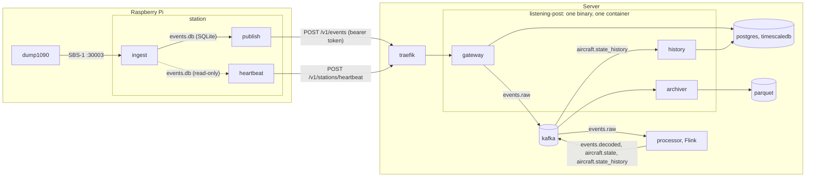

# Listening Post

An ADS-B flight tracking pipeline. [dump1090](https://github.com/flightaware/dump1090) is used to receive and decode ADS-B messages into the [SBS-1 BaseStation](http://woodair.net/sbs/article/barebones42_socket_data.htm) format.

## Architecture



dump1090 and the `station` package run on the Pi:

- **dump1090** ([flightaware/dump1090](https://github.com/flightaware/dump1090)) — reads the SDR dongle, decodes ADS-B, and serves SBS-1 text on TCP port 30003. Not part of this repo; install from the FlightAware packages (or `brew install dump1090-mutability`/`dump1090` locally). `just dump1090` starts it with the right flags: networking on, bound to localhost, CRC error correction, and `TZ=UTC` so its timestamps agree with ingest's.
- **station** (`station/`, Python stdlib) — `python3 -m station` starts the three loops below as child processes and restarts any that exit, so there is one directory to copy and one process to manage. Each child is its own process: it keeps its own SQLite connection, and a crash in one doesn't stop the others.
  - **ingest** — connects to dump1090 and appends every raw line to a SQLite table with a timestamp (the buffer drops blank lines, which the feed emits around a reconnect). Reconnects if dump1090 restarts.
  - **publish** — reads batches from that table, POSTs them to the gateway, and deletes rows only after a 2xx. Retries the same batch after any failure, logging the gateway's reply.
  - **heartbeat** — every `INTERVAL_SECONDS`, reads the buffer (read-only) and the OS and POSTs a status report: uptime, free disk, buffer depth, event rate, last event/publish times. Independent of ingest and publish so it keeps reporting when they don't.

The SQLite file is the buffer between the two: it survives Pi reboots and gateway outages, so the pipeline never loses data as long as the Pi has disk. `station/buffer.py` is the only module that knows its schema — the supervisor creates it, ingest appends, publish drains from the head, heartbeat samples it read-only — so the loops hold no SQL. Requirements on the Pi are just Python ≥ 3.11 and dump1090 — no packages to install. Deploying is `scp -r station/ pi:~/` and one systemd unit:

```ini
[Service]
WorkingDirectory=%h
Environment=STATION_TOKEN=...
ExecStart=/usr/bin/python3 -m station
Restart=always
```

Resilience is three layers, each for a distinct failure mode: the loops retry *inside* (ingest reconnects, publish re-sends after a failed POST), so transient network and SQLite errors never exit them; the supervisor restarts a loop that exits anyway (an uncaught exception); and systemd restarts the supervisor itself if that dies. The supervisor's restart is therefore a rare safety net, not the primary retry path.

Both scripts batch their I/O deliberately. SD cards have limited write endurance, and dump1090 can produce hundreds of lines per second; committing each one to SQLite individually would burn through a card in months. Ingest writes one transaction per `INGEST_BATCH_SIZE` lines / `FLUSH_SECONDS`, and publish sends `PUBLISH_BATCH_SIZE` events per request, so both disk writes and HTTP round-trips stay low.

The server side is one Go binary (`main.go`, `internal/`) running the gateway, archiver, and history writer as goroutines in one container via `docker compose` (`just up`), plus the processor as an [Apache Flink](https://flink.apache.org) job (`flink/`) in its own containers. They talk through Kafka, not each other, and if any service dies the whole binary exits and compose restarts it. Each reads the variables it needs: `KAFKA_BROKERS` everywhere, `DATABASE_URL` in the gateway and history writer, `ARCHIVE_DIR` in the archiver.

The gateway (`internal/gateway/`) authenticates and validates incoming batches and heartbeats, stores heartbeats in Postgres, and publishes each event to Kafka. Its health probes live on a separate admin port (`:9091`); `/readyz` also checks Postgres and Kafka. `POST /pause` and `/resume` on that port make the events endpoint answer 503 while the gateway stays up and pause the archiver's consumer in-process; the backfill uses them to stop ingest and archiving without taking the container down.

Traefik is there to terminate TLS once there is a real hostname (add a `websecure` entrypoint and an ACME resolver to `compose.yaml`). **Do not point a Pi at a public gateway over plain HTTP** — the station token is the whole credential and would be sent in the clear.

### Registering a station

Each publisher authenticates with a bearer token. Stations are identified by a generated UUID — there is no name, so a device can be registered before anyone decides what to call it. A station can have several tokens at once; the gateway stores only their SHA-256 hashes (`stations`, `station_tokens`).

```sh
just station-add              # prints STATION_ID=<uuid> and STATION_TOKEN=...
just station-list
just station-revoke 3f2a      # kills every token; soft: rows and heartbeats remain
```

Anywhere a recipe takes a station, a UUID or an unambiguous prefix works (as with git commits).

Set `STATION_TOKEN=<token>` in the station's environment. None of this needs a gateway restart.

#### Rotating a token

Rotation is add → switch → revoke, so the station never sees a 401:

```sh
just station-token-add 3f2a                    # prints a new STATION_TOKEN; the old one still works
# update STATION_TOKEN on the Pi, restart station, confirm station=<uuid> still appears in the gateway log
just station-tokens 3f2a                       # hash prefixes with created/revoked times
just station-token-revoke 3f2a <old prefix>
```

## Gateway

Public routes (both require `Authorization: Bearer <token>`):

- `POST /v1/events` — a batch of raw SBS-1 lines from the station's buffer.
- `POST /v1/stations/heartbeat` — periodic station status: uptime, free disk, buffer depth, and optional diagnostics (see `heartbeatRequest` in `internal/gateway/handlers.go`).

The public API listens on 8080 and the internal `/healthz` and `/readyz` probes on 9091.

| Variable        | Default         | Purpose                                  |
|-----------------|-----------------|------------------------------------------|
| `DATABASE_URL`  | *(required)*    | Postgres connection URL                  |
| `KAFKA_BROKERS` | *(required)*    | Comma-separated bootstrap brokers        |

### Database

Postgres runs as a compose service and is shared by every server-side service, so the schema is owned by the repo, not by any one service. The image is [TimescaleDB](https://www.timescale.com/) (a Postgres extension for time-series) so the one instance serves both the low-volume station registry (`stations`, `station_tokens`), heartbeat history (`heartbeats`), and the high-volume aircraft Traces (`aircraft_traces`, a hypertable). migrations live in `db/migrations/` in [goose](https://github.com/pressly/goose) SQL format, in a single sequence, and are applied out-of-band — never by a service at startup:

```sh
just migrate          # apply pending (just up runs this for you, after postgres is healthy)
just migrate-status
just migrate-down     # roll back one
```

The goose CLI is pinned in `go.mod` via the `tool` directive, so `go tool goose` needs nothing installed. `just test-server` needs Docker: the tests start throwaway TimescaleDB and Kafka containers with testcontainers; `go test -short ./...` skips those.

### Archiver

`internal/archiver/` consumes `events.raw` and writes every record, untouched, to Hive-partitioned Parquet under `archive/` — the raw system of record everything downstream can be rebuilt from (the "sushi principle": store the raw fish).

```
archive/dt=2026-09-14/station=3ae884ac-…/p1-000000000475-000000010474.parquet
```

- `dt` is the event date (`ts`, UTC), so a station's late backlog lands in the right day. Files are named by Kafka partition and offset range, so re-processing after a crash regenerates the same files instead of duplicating rows. Offsets are committed only after a batch's files are renamed into place. A batch is 10,000 records or 5 minutes, whichever comes first.
- Columns: `station_id, id, ts, raw, received_at, kafka_partition, kafka_offset, kafka_timestamp`. Undecodable records are kept under `dt=unknown/station=unknown` with their bytes in `raw`.
- Query it in place:
  ```sql
  SELECT dt, station, count(*) FROM read_parquet('archive/**/*.parquet', hive_partitioning = true) GROUP BY ALL;
  ```

| Variable        | Default      | Purpose                                            |
|-----------------|--------------|----------------------------------------------------|
| `KAFKA_BROKERS` | *(required)* | Comma-separated bootstrap brokers                  |
| `ARCHIVE_DIR`   | *(required)* | Root directory for Parquet files                   |

`just up` creates `archive/` world-writable because the container runs as `nonroot` against a bind mount; revisit when storage moves to S3.

### History

`internal/history/` consumes `aircraft.state_history` and inserts every Trace into the `aircraft_traces` hypertable in TimescaleDB, so flight paths can be drawn later with a plain SQL range scan. It commits Kafka offsets only after a batch's rows are in the table; each Trace carries its triggering Event's identity, which rides a `UNIQUE (event_station_id, event_id, event_ts, last_seen)` constraint, so an at-least-once re-read after a crash — or a re-fold of the same archive — is a no-op rather than a duplicate row. A batch is 1,000 rows or 5 seconds, whichever comes first.

```sql
SELECT lat, lon, position_ts FROM aircraft_traces
WHERE icao = 'A22123' AND last_seen BETWEEN '2026-09-14 00:00Z' AND '2026-09-15 00:00Z'
ORDER BY position_ts;
```

Chunks compress after 7 days (`add_compression_policy`); there is no retention policy yet — history is kept forever until one is wanted.

### Backfill

`just backfill` rebuilds the Traces (and the live picture) from the archive. It pauses ingest and the archiver via the admin endpoint (the gateway keeps serving heartbeats but answers 503 to `POST /v1/events`, so stations buffer), stops the processor, truncates and replays `events.raw` (truncated, not deleted, so the gateway's producer keeps working), truncates `aircraft_traces`, clears the Flink checkpoint, then replays the archive in event-time order (`cmd/backfill`, a Go program that reads `archive/*.parquet` and sorts by `ts`). The processor re-folds the whole history from scratch; the history writer — still running — persists the new Traces; the archiver resumes past the replay. The archive itself is never touched, and the natural Trace key makes the rebuild re-runnable. It's a destructive, one-shot operation — `scripts/backfill.sh` refuses to run if `archive/` is missing or empty.

| Variable        | Default      | Purpose                                          |
|-----------------|--------------|--------------------------------------------------|
| `KAFKA_BROKERS` | *(required)* | Comma-separated bootstrap brokers                |
| `DATABASE_URL`  | *(required)* | TimescaleDB connection URL (shared with gateway) |

### Processor

`flink/` is the one place SBS-1 is parsed: a Flink DataStream job (see `docs/adr/0001-processor-as-flink-job.md` for why not Go). A stateless `flatMap` reads `events.raw` and writes one typed JSON record per line to `events.decoded`, keyed by ICAO (station id if the line has none) so an aircraft's messages stay ordered within a partition. Lines that don't parse are logged and skipped — the archive has them, and `events.decoded` is derived data.

The record is the raw envelope (`station_id`, `id`, `ts`, `received_at`) plus the [SBS-1 fields](http://woodair.net/sbs/article/barebones42_socket_data.htm), present only when the line carried them:

| key | type | SBS field |
|---|---|---|
| `message_type` | string | 1 — `MSG` |
| `transmission_type` | int | 2 — 1 ident, 2 surface pos, 3 airborne pos, 4 velocity, 5 alt, 6 squawk, 7 air-to-air, 8 all-call |
| `icao` | string | 5 |
| `generated`, `logged` | string | 7–10, verbatim (see below) |
| `callsign` | string | 11, trimmed |
| `altitude` | int, feet | 12 |
| `ground_speed` | float, knots | 13 |
| `track` | float, degrees | 14 |
| `lat`, `lon` | float | 15–16 |
| `vertical_rate` | int, ft/min | 17 |
| `squawk` | string | 18 (leading zeros kept) |
| `alert`, `emergency`, `spi`, `on_ground` | bool | 19–22 (`-1` → true) |

`ts` is the authoritative event time. dump1090 stamps `generated`/`logged` in its process's local zone with no offset, so they're kept as strings rather than guessed at; `just dump1090` (and the Pi's systemd unit) run it with `TZ=UTC` so they line up.

#### Aircraft state

The decoded stream is then keyed by ICAO into a `KeyedProcessFunction` that folds it into per-aircraft state and publishes a **full snapshot** (never a delta) to `aircraft.state` whenever something changes. The topic is compacted, so it *is* the current picture of the sky: a consumer reads it from the beginning to get every live aircraft, then tails it for updates. An aircraft silent for `EXPIRE_SECONDS` gets a tombstone and drops out.

```json
{"icao":"A22123","callsign":"AAL433","altitude":8275,"ground_speed":117,"track":240,"lat":40.14684,"lon":-83.17065,
 "vertical_rate":0,"squawk":"6653","alert":false,"emergency":false,"spi":false,"on_ground":false,
 "first_seen":"…","last_seen":"…","position_ts":"…","stations":["3ae884ac-…"],"messages":412}
```

Each field updates only from a message at least as new as the one that last set it, so a station draining an old backlog can't regress live state while still filling anything newer messages lacked. State is one `ValueState<Aircraft>` per aircraft with a processing-time timer per aircraft that fires every 10 s: it tombstones the aircraft if it has been silent for `EXPIRE_SECONDS`, and republishes it if it was heard from but unchanged so `last_seen` and `messages` stay current. Processing time rather than event time because an idle receiver would stall watermarks and nothing would ever expire.

The job runs in application mode: `flink-jobmanager` runs the one job baked into the image, `flink-taskmanager` does the work, and checkpoints go to a shared volume. Checkpoints are retained rather than deleted on failure, and the jobmanager's entrypoint resumes from the newest complete one, so a restart of either container picks up where it left off without ZooKeeper or Kubernetes HA. The sinks are exactly-once: output is written in a Kafka transaction that commits with each checkpoint (every 2 s), so a crash rolls state and output back together — no duplicate snapshots and exact `messages` counts. The cost is latency: a consumer with `isolation.level=read_committed` (`just map` sets it) sees records only once the checkpoint commits, so the interval is kept short. The Flink UI is at http://localhost:8083. There's no JDK on the host: `just test-flink` builds the image, and the build stage runs the JUnit tests.

| Variable                | Default           | Purpose                                   |
|-------------------------|-------------------|-------------------------------------------|
| `KAFKA_BROKERS`         | *(required)*      | Comma-separated bootstrap brokers         |
| `EXPIRE_SECONDS`        | `300`             | Tombstone an aircraft silent this long    |

#### Traces

Every time the fold *actually changes* a snapshot, it also writes a **Trace** to `aircraft.state_history` — the same snapshot stamped with the identity of the raw Event that triggered it (`event_station_id`, `event_id`, `event_ts`), so a re-fold of the same events produces the same traces. The sweep's heard-but-unchanged republish and tombstones stay on `aircraft.state` only, so the history topic carries just the aircraft's real changes, in order, keyed by ICAO. It is append-only (not compacted): it's the record flight paths are drawn from, and `aircraft.state`'s compaction is what makes it history-keeping by itself impossible.

#### Map

`just map` serves a live Leaflet map of `aircraft.state` at <http://localhost:8082>. It's a host-side dev tool (`map/`, Python stdlib): it folds the compacted topic via `kafka-console-consumer` in a throwaway Kafka container on the compose network, so nothing needs installing, and the page polls `/state.json` every 2 s. Markers fade when their position is over a minute old.

### Kafka

A single-node Apache Kafka broker (KRaft, no ZooKeeper) runs as a compose service. Topics are declared by the one-shot `kafka-init` service, never auto-created, and their names are constants in the code that produces them (`internal/wire/` for the gateway, `ProcessorJob.java` for the processor): `events.raw` (keyed by station, archived), `events.decoded` (keyed by ICAO), `aircraft.state` (keyed by ICAO, compacted), and `aircraft.state_history` (keyed by ICAO, append-only), 3 partitions each, default 7-day retention — `events.raw`'s can shrink now that the archive is the system of record.

The gateway publishes one record per event to `events.raw`, keyed by station UUID so a station's events stay ordered within a partition. The value is JSON: `{"station_id","id","ts","raw","received_at"}` (`wire.Event` in `internal/wire/`; the processor's `Decoded`, `Snapshot`, and `Trace` live in `flink/`). `internal/wire/testdata/` holds golden fixtures: raw line → decoded record, message sequence → snapshots, and a changed snapshot → trace (run by the processor's tests), and the heartbeat and events request bodies (produced by the station's tests, accepted by the gateway's), so every cross-language contract is checked against the same data rather than kept in step by hand. See `CONTEXT.md` for the vocabulary. It answers a station's `POST /v1/events` with 200 only after the broker has acknowledged every record, and the station deletes its buffered rows only on that 200 — so delivery is at-least-once: a batch whose 200 never reached the station is re-sent. The archive keeps duplicates (they carry distinct offsets); the state fold and the trace writer tolerate them.

- `just kafka-topics` lists topics; [Kafbat UI](https://github.com/kafbat/kafka-ui) is at http://localhost:8081 (localhost-only, no auth).
- Inside the compose network the broker is `kafka:9092`; from the host it's `localhost:9094`.
- `KAFKA_CLUSTER_ID` in `.env` is generated once per environment (see `.env.example`) and must never change — the persisted log directory is bound to it.

#### Zero-downtime migrations

Deploys are two steps in this order: **1. `just migrate`, 2. deploy the new binary.** Between those steps the *old* gateway runs against the *new* schema, so every migration must be backward compatible with the version currently deployed. In practice (expand/contract):

- Adding is safe in one release: new tables, new nullable columns (or columns with a default), new indexes.
- Removing or tightening needs two releases: first ship code that no longer depends on the column/table/constraint, then a later migration drops it. Renames are a drop and an add.
- `down` migrations exist for local development. Rolling back in production means deploying the previous gateway, which the additive schema still supports.
- Indexes on large tables: `CREATE INDEX CONCURRENTLY` in a `-- +goose NO TRANSACTION` migration, so the live gateway isn't blocked.

Gateway code keeps this workable by always naming columns — explicit lists in `INSERT`, no `SELECT *` — so a column the running version doesn't know about is simply ignored.

## Station

The three loops share one environment, so their variable names are disjoint. Read by the supervisor and every child:

| Variable          | Default            | Purpose                                                |
|-------------------|--------------------|--------------------------------------------------------|
| `STATION_TOKEN`   | *(required)*       | Bearer token from `just station-add`                   |
| `GATEWAY_URL`     | `http://localhost` | Gateway base URL (Traefik entrypoint)                  |
| `DB_PATH`         | `events.db`        | SQLite buffer file, relative to the working directory  |
| `LOG_LEVEL`       | `INFO`             | `DEBUG` logs every raw line                            |
| `RESTART_SECONDS` | `5`                | Delay before restarting a child that exited            |

### Ingest

| Variable            | Default     | Purpose                                      |
|---------------------|-------------|----------------------------------------------|
| `DUMP1090_HOST`     | `localhost` | dump1090 host                                |
| `DUMP1090_PORT`     | `30003`     | dump1090 SBS-1 BaseStation port              |
| `INGEST_BATCH_SIZE` | `100`       | Commit after this many lines                 |
| `FLUSH_SECONDS`     | `5`         | Commit after this long since the last commit |

Batching keeps SD card writes down; on power loss at most one batch is lost. A normal stop (SIGINT/SIGTERM) flushes everything.

### Publish

| Variable             | Default | Purpose                        |
|----------------------|---------|--------------------------------|
| `PUBLISH_BATCH_SIZE` | `500`   | Events per POST                |
| `POLL_SECONDS`       | `2`     | Sleep when the buffer is empty |
| `RETRY_SECONDS`      | `5`     | Sleep after a failed POST      |

Rows are deleted from the buffer only after the gateway returns 2xx, so delivery is at-least-once: a crash between the response and the delete re-sends that batch. The station (resolved from the token) plus `id` identifies an event uniquely across re-sends. Every failed POST is retried after `RETRY_SECONDS` with the gateway's reply in the log — a 4xx included, since it means the two sides disagree on the contract and the data should wait in the buffer rather than be dropped; `buffer_depth` climbing in the heartbeats is the alarm. The buffer only accepts rows the gateway will (non-blank `raw`), so publish trusts what it reads.

### Heartbeat

| Variable           | Default | Purpose                 |
|--------------------|---------|-------------------------|
| `INTERVAL_SECONDS` | `60`    | Seconds between reports |

Event rate and last event/publish times are derived from how the buffer changes between ticks, so they're absent on the first report after a restart and accurate to `INTERVAL_SECONDS` thereafter.
